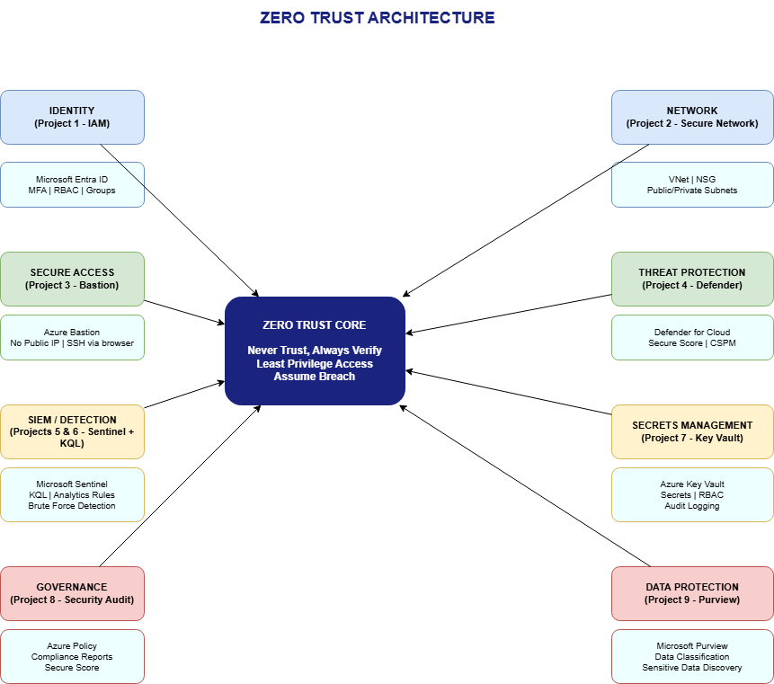

# Project 10 — Zero Trust Architecture Diagram

## Overview

Zero Trust is not a product you buy or a single tool you configure — it's a security model that runs through every decision you make about access, identity, and data. This project brings together everything built across the previous nine projects into a single architecture diagram, showing how each piece contributes to a Zero Trust posture in Azure.

## What is Zero Trust?

The traditional security model assumed that everything inside the corporate network was safe. Zero Trust flips that assumption entirely:

- **Never trust, always verify** — every access request is authenticated and authorized, regardless of where it comes from
- **Least privilege access** — users and applications get only the permissions they need, nothing more
- **Assume breach** — design systems as if attackers are already inside, and monitor everything

## How this portfolio maps to Zero Trust

| Zero Trust Pillar | Project | What it covers |
|---|---|---|
| Identity | Project 1 — IAM | Microsoft Entra ID, MFA, RBAC, Groups |
| Network | Project 2 — Secure Network | VNet, NSG, public/private subnet segmentation |
| Secure Access | Project 3 — Bastion | No public IP, SSH via browser, no exposed ports |
| Threat Protection | Project 4 — Defender for Cloud | CSPM, Secure Score, security recommendations |
| SIEM / Detection | Project 5 — Sentinel | Log ingestion, analytics rules, incident detection |
| Detection Logic | Project 6 — KQL Brute Force | KQL queries, MITRE ATT&CK mapping, automated alerts |
| Secrets Management | Project 7 — Key Vault | Secure credential storage, RBAC, audit logging |
| Governance | Project 8 — Security Audit | Azure Policy, compliance reports, posture management |
| Data Protection | Project 9 — Purview | Data classification, sensitive data discovery |

## Architecture Diagram

The diagram shows each security domain connected to the Zero Trust core — illustrating that Zero Trust is not a single layer of defense but a set of overlapping controls that together reduce risk across identity, network, data, and operations.

## Why this matters

A Zero Trust architecture is the standard approach for cloud security in modern enterprises. Understanding how identity, network controls, threat detection, secrets management, governance, and data protection work together — not in isolation — is what separates a security professional from someone who just knows individual tools.

This portfolio demonstrates that each component was built with Zero Trust principles in mind: verify identity before granting access, restrict permissions to the minimum required, monitor continuously, and protect data regardless of where it lives.

## Screenshots

| File | What it shows |
|------|---------------|
| [01-zero-trust-diagram.png](./Screenshots/01-zero-trust-diagram.png) | Complete Zero Trust architecture diagram |